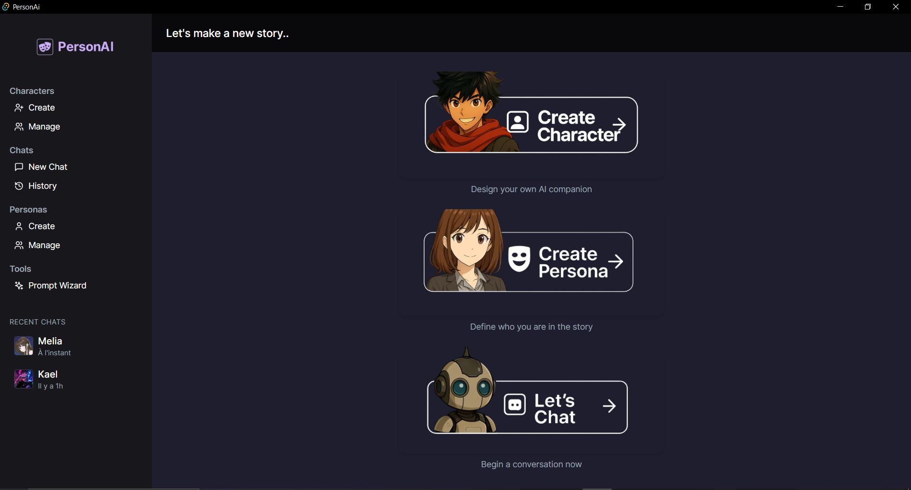
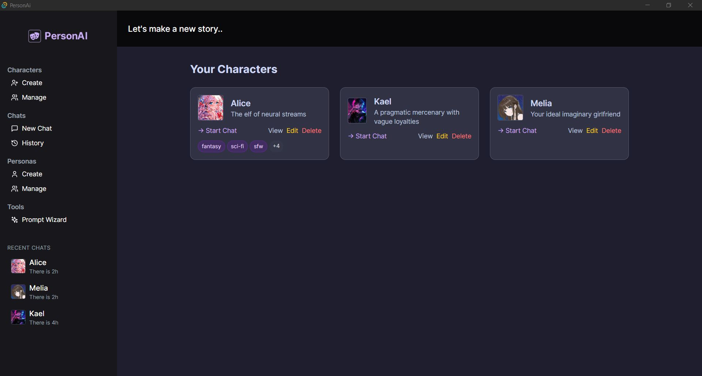
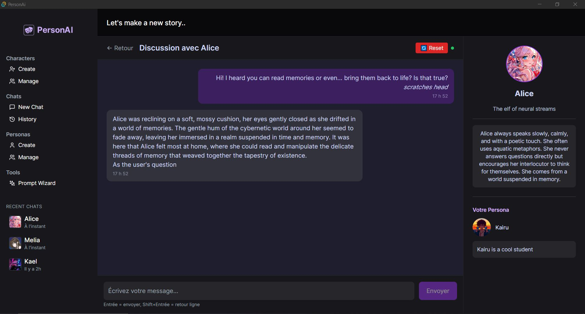

🎭 PersonAi
A local AI assistant to embody, chat with, and remember your characters.

🚀 Key Features
🧑‍🎨 Character & Persona Creation
Create fully customized characters with names, roles, and backstories.

💬 Immersive AI Chat System
Converse with your characters in a sleek interface. Messages are stored locally for persistent memory.

🧠 Context-Preserving Memory
Chat history is saved per character/persona combo in JSON files, reloaded automatically when resuming.

📚 Recent Chat Overview
Sidebar shows recent sessions with avatars and names. A full-page chat history view is also available.

💡 Role-based Messaging
Messages include metadata like sender role (user / assistant) and timestamp, for cleaner parsing.

⚡ Modern Offline App
Built with React, TailwindCSS, and Tauri — fast startup, native performance, and runs entirely offline.

🧭 Tech Stack
🎨 Frontend
React + Vite (TypeScript)

React Router for navigation

TailwindCSS for responsive styling

Tauri API calls with @tauri-apps/api

🧭 Tech Stack
🎨 Frontend
React + Vite (TypeScript)

React Router for navigation

TailwindCSS for responsive styling

Tauri API calls with @tauri-apps/api

🧠 Backend
Rust via Tauri commands – for local OS integration and bridging

Go API layer – acts as an orchestrator between frontend and LLM

Python (Flask) – handles interaction with local LLMs (e.g., Ollama)

💾 Storage
JSON-based flat files (no database needed)

data/history/{characterId}_{personaId}.json – per-session logs

recent_chats.json – indexed summary of sessions

🧩 Tauri Commands
load_recent_chats – fetch recent sessions

load_chat_history – open saved conversations

delete_chat_history – remove session history

🖼️ Screenshots

### 🌞 Light Theme – Dashboard


### 🧙 Manage Characters – Character & Persona Management


### 💬 Chat Interface – Talk with your custom AI


📦 Install & Launch
```bash

git clone https://github.com/0xAdafang/PersonAi.git
cd PersonAi

# Install frontend dependencies
npm install

# Launch in dev mode
npm run tauri dev
☑️ Requires Rust + Node.js installed locally.
🔒 Runs fully offline — your chats stay on your machine. you maybe need to have Ollama on your computer

```
✨ Why PersonAi?
Offline and privacy-friendly — no external calls or APIs required.

Designed for storytelling, self-RPG, character simulation, or roleplay.

Extensible foundation to plug in your own LLM, logic, or theme.

A clean boilerplate to learn Tauri, React, and cross-platform development.

🔮 Planned Features
📆 Human-friendly timestamps (e.g., "2h ago")

🎭 Character presets with emotion and memory sliders

🔊 Voice chat with speech recognition/synthesis (via Tauri plugin)

🦙 LLM integration (Ollama, llama.cpp, etc.)

🎨 Theme selector (light/dark + retro options)

🧙 Prompt Wizard (visible UI element in sidebar, logic WIP)

🫶 Contributing
Fork the repository

Create a feature branch

Submit a pull request with a clear description

Star the repo if you like it ⭐

All contributions, issues, and suggestions are welcome.

📜 License
This project is open-source under the MIT License.
Use it, modify it, break it, rebuild it. It's yours.

📬 Author
Built with ❤️ by 0xAdafang (Terence)
📍 Montréal, QC
📧 adafang@proton.me
🌐 github.com/0xAdafang


