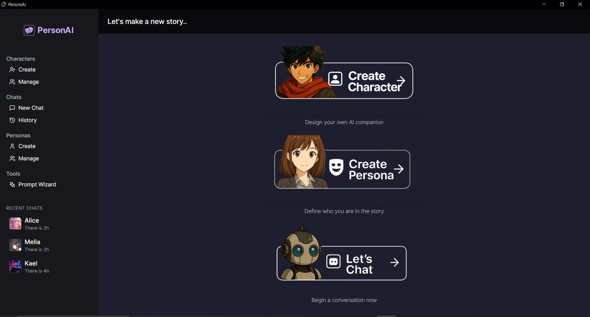

🎭 PersonAi
A local desktop assistant to create, embody, and chat with fully customized AI characters.

🚀 Key Features
Character & persona creation via an interactive UI.

Immersive chat system with persistent local history (stored in JSON).

Recent chat memory displayed in the sidebar and in a full-page view.

Modern UI powered by React, TailwindCSS, and Tauri for fast native performance.

Role-based message structuring (user / assistant) with accurate timestamps.

Automatic history reload when clicking a recent chat.

### 🌞 Dashboard



🧭 Tech Stack
Front‑end:

TypeScript (React + Vite)

React Router for navigation

Tailwind CSS for styling

Tauri API via @tauri-apps/api/tauri (invoke())

Back‑end:

Rust via Tauri (local command bridge)

Chat history saved in data/history/{characterId}_{personaId}.json

Recent chats indexed in recent_chats.json

Commands include:

load_recent_chats: list recent sessions

load_chat_history: load specific chat messages

delete_chat_history: delete a session

⚙️ Setup & Launch

```bash
git clone https://github.com/0xAdafang/PersonAi.git
cd PersonAi

# Install frontend dependencies
npm install

# Launch in dev mode
npm run tauri dev
Requires Rust + NodeJS installed locally.
The app runs fully offline and is cross-platform.
```

### 🧙 Manage Characters – Character & Persona Management


🛠️ Future Ideas & Enhancements
Relative date formatting (e.g. “2 hours ago”)

Character presets with lore and dynamic emotions

Audio mode with speech synthesis and recognition (via Tauri plugin)

Integration with local LLMs like llama.cpp or Ollama

Theme customization (dark/light, neon retro, etc.)

Prompt Wizard - button are here in the sidebar but the option and logic missing for now

✅ Why PersonAi is Useful
Offline, privacy-friendly personal assistant framework

Designed for custom storytelling, RPGs, and character roleplay

Fully open-source, local-first, and extensible

A perfect boilerplate to connect any AI model and UI layer

### 💬 Chat Interface – Talk with your custom AI


🫶 Contributing
Fork the repo

Create a feature branch

Submit a pull request with clear description

Suggestions & improvements are welcome!

📜 License
This project is open-source under the MIT License.
Feel free to use, modify, and build upon it.

📬 Contact
Created by 0xAdafang (Terence) – Montréal, QC
📧 Email: adafang@proton.me
🌐 GitHub: github.com/0xAdafang

